# printree

[](https://travis-ci.org/chrizzFTD/printree)
[](https://coveralls.io/github/chrizzFTD/printree?branch=master)
[](https://printree.readthedocs.io/en/latest/?badge=latest)
[](https://badge.fury.io/py/printree)
[](https://pypi.python.org/pypi/printree)

Tree-like formatting for arbitrary python data structures.

## Instalation
```bash
pip install printree
```

## Usage
`printree` aims to be similar to pretty print ([pprint](https://docs.python.org/3/library/pprint.html)) but in the form of a tree:

```python
>>> from printree import ptree, ftree
>>> ptree({"x", len, 42})  # will print to the output console
┐
├─ 0: x
├─ 1: <built-in function len>
└─ 2: 42
>>> ftree({"x", len, 42})  # will return a string representation
'┐\n├─ 0: x\n├─ 1: <built-in function len>\n└─ 2: 42'
```

Instances of [abc.Iterable](https://docs.python.org/3/library/collections.abc.html#collections.abc.Iterable) (with the exception of [str](https://docs.python.org/3/library/stdtypes.html#text-sequence-type-str) & [bytes](https://docs.python.org/3/library/stdtypes.html#bytes-objects)) should be translated into a tree-like form.
All other objects will be considered "leaf nodes":
```python
>>> dct = {
...     "foo": [],
...     True: {
...         "uno": {"ABC", "XYZ"},
...         "dos": r"B:\newline\tab\like.ext",
...         "tres": {
...             "leaf": b"bytes",
...             "numbers": (42, -17, 0.01)
...         },
...     },
...     ("unsortable", ("tuple", "as", "key")):
...         {"multi\nlined\n\ttabbed key": "multi\nline\n\ttabbed value"}
... }
>>> dct["recursion"] = [1, dct, 2]
>>> ptree(dct)
 ──┐
   ├─ foo
   ├─ True
   │  ├─ uno
   │  │  ├─ 0: ABC
   │  │  └─ 1: XYZ
   │  ├─ dos: B:\newline\tab\like.ext
   │  └─ tres
   │     ├─ leaf: b'bytes'
   │     └─ numbers
   │        ├─ 0: 42
   │        ├─ 1: -17
   │        └─ 2: 0.01
   ├─ ('tuple', 'as', 'key')
   │  └─ multi
   │     lined
   │            tabbed key: multi
   │                        line
   │                            tabbed value
   └─ recursion
      ├─ 0: 1
      ├─ 1: <Recursion on dict with id=2039314371008>
      └─ 2: 2
```

## Custom formatters 
A custom TreePrinter object can be passed to achieve a different representation. 
An `AsciiFormatter` is provided to use:
```python
>>> from printree import ptree, AsciiPrinter
>>> obj = [42, {"foo": (True, False)}]
>>> ptree(obj, AsciiPrinter())
 --.
   |- 0: 42
   `- 1
      `- foo
         |- 0: True
         `- 1: False
```
New formatters can change each of the string representations of the tree.
The main members to override from the provided classes are:
- `ROOT`
- `LEVEL_NEXT`
- `LEVEL_LAST`
- `BRANCH_NEXT`
- `BRANCH_LAST`

The `level` attribute will be automatically set on the formatter instance to indicate the current depth in the traversal of the tree.

For example, to make the formatter print with a different color on every branch level, this could be an approach:

```python
from printree import ptree, UnicodeFormatter

class ColoredUnicode(UnicodeFormatter):
    colors = {
        0: '\033[31m',  # red
        1: '\033[32m',  # green
        2: '\033[33m',  # yellow
        3: '\033[36m',  # cyan
        4: '\033[35m',  # magenta
    }
    _RESET = '\033[0m'

    def __getattribute__(self, item):
        if item in ("LEVEL_NEXT", "LEVEL_LAST", "BRANCH_NEXT", "BRANCH_LAST"):
            return f"{self.color}{getattr(super(), item)}{self._RESET}"
        return super().__getattribute__(item)

    @property
    def color(self):
        return self.colors[self.level % len(self.colors)]

    @property
    def ROOT(self):  # for root (level 0), prefer the color of the children (level 1) 
        return f'{self.colors[1]}{super().ROOT}{self._RESET}'

multiline = {"foo": {False: {"AB\nCD": "xy", 42:len}, True: []}, ("bar",): []}
dct = {"A": multiline, "B": (multiline,), "C\nD": "x\ny", "F": (1, "2")}

import os
os.system("")  # required on windows only

ptree(dct, formatter=ColoredUnicode)
```
Which outputs:

